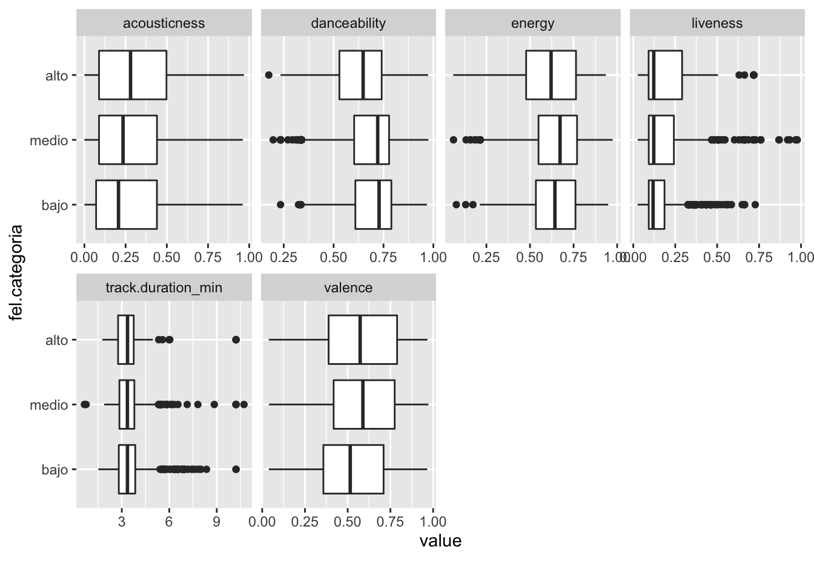
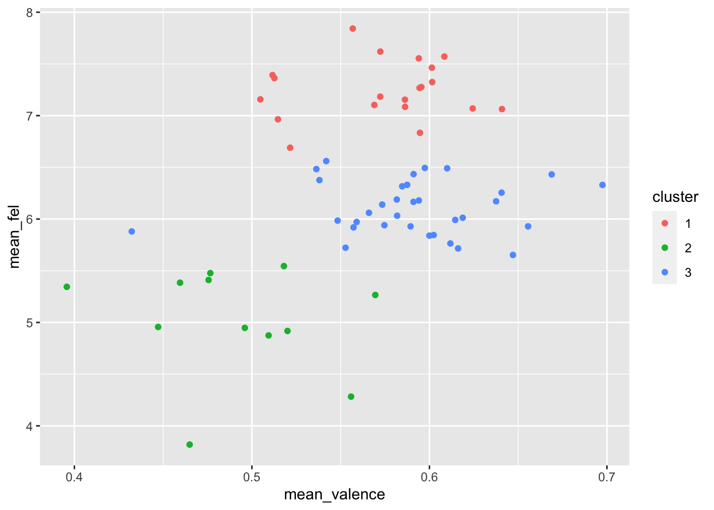

```{r setup, include=FALSE}
knitr::opts_chunk$set(echo = TRUE)
```

## Introducción

En este proyecto se busca relacionar el índice de felicidad mundial con la las propiedades de audio de las canciones mas escuchadas en los distintos países. Para esto, se usará los datos oficiales del World Happiness Report para el índice de felicidad, y de Spotify para las canciones más escuchadas y sus características.

Se buscan investigar los siguientes puntos

-   ¿Hay una correlación entre el índice de felicidad y la positividad/negatividad en las canciones más populares?
-   ¿Se puede diferenciar un patrón en las canciones populares de un país en base a su índice de felicidad?

## Obtención de datos

Se trabajo con 2 tipo de datos, una fue el índice de felicidad mundial para el año 2020 y la otra características de audio de canciones

### Índice de felicidad
Se obtuvieron los datos para el año 2020, que son promedios de los años 2018,2019 y 2020, para cada país. Se descargaron de la fuente oficial de [The World Happiness Report](https://worldhappiness.report).

### Características de audio

Para las características de audio se trabajó con datos proporcionados por la [API Web de Spotify](https://developer.spotify.com/documentation/web-api/). Se buscaron las playlists de top 50 canciones más escuchadas para cada país y se hizo una consluta a la página para descargar las respectivas características de audio.

Se pudieron recaudar datos de canciones solamente para 65 de los 149 países, por lo que en los análisis de datos que se harán se toman en cuenta a 65 países solamente.

### Diccionario de datos

Un diccionario describiendo las variables puede encontrarse en el archivo ```diccionario.xlsx``` en la carpeta ```data```.

## Resultados

### Categorización de variables

Se hizo una categorización en el índice de felicidad en base al espaciamiento de los datos, las categorías elegidas fueron

- **bajo**
- **medio**
- **alto**

### Relaciones

Se graficaron diagramas de caja para ver si hay alguna separación de las características de audio, respecto a las categorías del índice de felicidad que se hicieron



Se ve que en base a las 3 categorías no se observa mucha diferencia en las características de audio a simple vista, por lo que esto sería adecuado investigarse con algún método de clasificación de aprendizaje automático supervisado.

Además, se hace una gráfica del índice de felicidad respecto a los promedios de *valence* de las 50 canciones más escuchadas por cada país. Se dividio en tres grupos con un algoritmo de agrupamiento de k-medias, lo que se distingue por colores en la gráfica:



En general el agrupamiento se observa bueno, hace una clara distinción en tres partes al eje y del índice de felicidad. Lo que indicaría que podría haber alguna relación en la positivdad/negatividad de las canciones de acuerdo al índice de felicidad.

## Conclusiones

Se observa una relación no lineal entre el índice de felicidad y el promedio de *valence* de las 50 canciones más escuchadas de cada país, y se puede hacer una separación por clusters de k-medias. Para este caso se vió que agrupar en 3 es adecuado.

Por último, para involucrar a las demás características numéricas restantes como *energy* o *acousticness*, lo que puede hacerse es aplicar algún algoritmo de clasificación tomando como base las clases creadas para el índice de felicidad, de bajo, medio, alto. Un algoritmo adecuado podría ser el de *k vecinos más cercanos* o bien algún algoritmo estadística de clasificación o de inferencia con lógica difusa. Un algoritmo como redes neuronales artificiales no sería muy adecuado por los pocos datos que se tienen.


